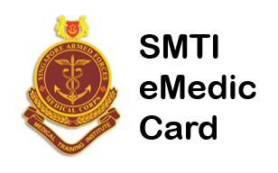

# SMTI eMedic card

Intern: Ng Ri Chi (May-August 2021)

Supervisor: Hang Kher Lee

SMTI eMedic card aims to replace the physical Medic card carried by SAF Medics. The webportal is built on flask, Flask-WTF and Flask-SQLalchemy. The database is based on SQLlite and the CSS library used are Bootstrap and Bootstrap Table.

## Content
1. Quick start
2. Structure of Application
3. Database and Models
4. Forms
5. Views and User Management
6. Query and Modifying

## 